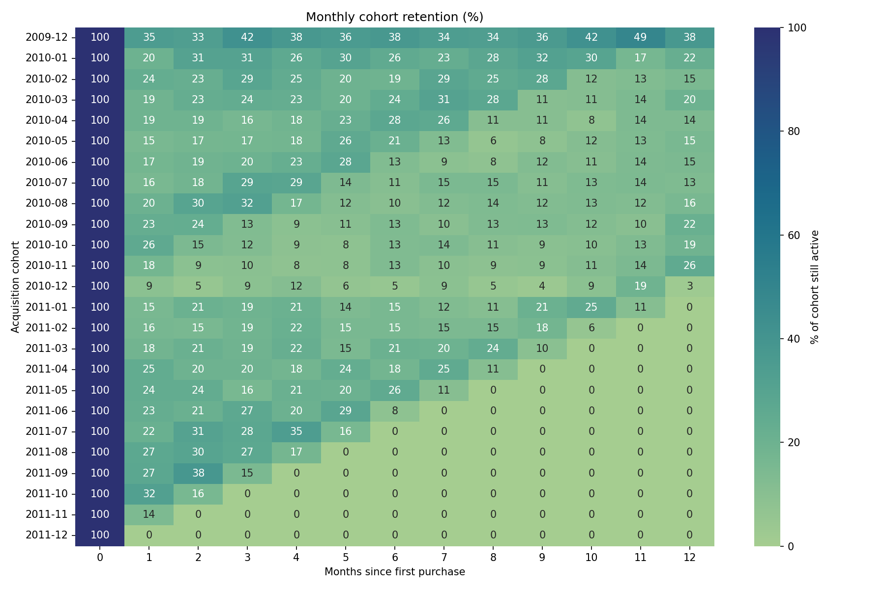
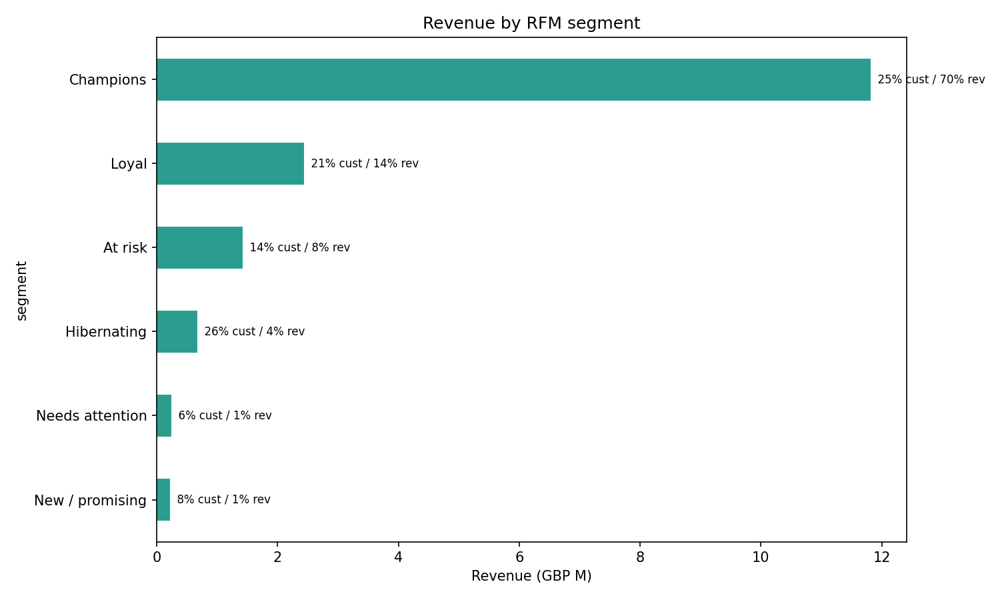
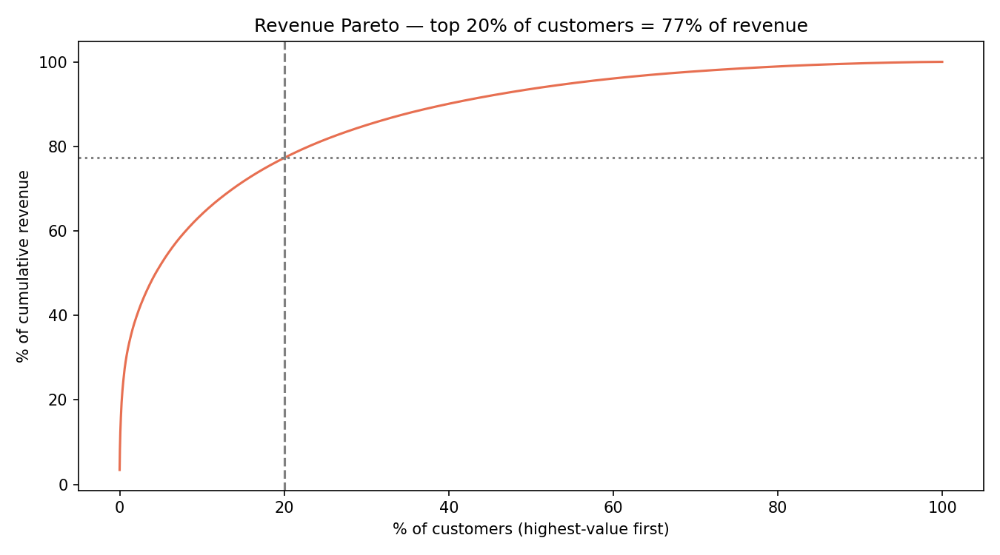
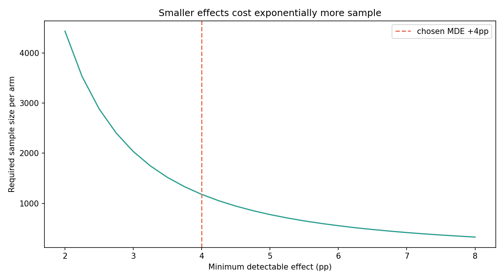
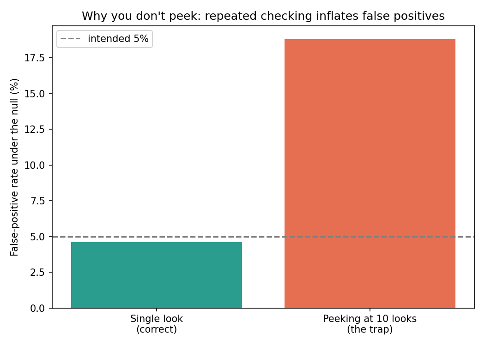

# E-commerce Growth & Experimentation — where does the revenue actually come from, and does the intervention work?

**Business questions:** which customers drive the revenue, how fast do cohorts churn, and — the growth-team question — **does a win-back campaign actually lift reactivation, or does it just look like it did?**

This is the product/growth-analytics job at a consumer company (Flipkart, Swiggy, CRED, Myntra-tier): funnels and cohorts to find the leak, RFM to find the customers worth keeping, and a **properly-designed A/B test** to prove an intervention works before rolling it out. Built on **805,549 real transactions** (UCI Online Retail II, a UK online retailer, Dec 2009 – Dec 2011, £17.7M revenue, 5,878 customers).

> **On SaaS metrics:** this is *transactional retail*, not a subscription book, so I don't fake MRR/ARR here. But the engines a SaaS/product team runs on — **cohort retention curves, revenue concentration, RFM/segment value, and experiment design** — are exactly what's built below, on the same methods. The subscription-native metrics (MRR, ARR, revenue churn, LTV) live in the sister project, [customer-churn-consulting](../customer_churn_consulting), where the data actually supports them.

**Stack:** Python (pandas, scikit-learn, scipy, seaborn) · Streamlit (live dashboard) · MySQL · A/B testing · cohort & retention analytics

## Headline findings

1. **Retention, not acquisition, is the leak.** On average only **~20%** of a monthly cohort returns the next month, falling toward ~14% by month 6. Spending on acquisition without fixing retention pours revenue into a leaky bucket.
2. **Revenue is dangerously concentrated.** The **top 20% of customers drive 77% of revenue** (Pareto), and the *Champions* RFM segment is **25% of customers but 69% of revenue** — lose them and the business breaks.
3. **A win-back A/B test, designed correctly.** Powering for a +4pp reactivation lift needs **1,178 customers per arm**; the At-risk pool is only 824, so the honest answer is *this needs a smaller MDE or a multi-send* — a real feasibility constraint most "I ran a t-test" analyses miss. On a correctly-powered simulated run (true +5pp effect), the test detects it: **+3.1pp lift, p = 0.031, ship it.**
4. **Why experiment discipline matters — the peeking trap, simulated.** Under the null (no real effect), reading the result once gives the intended **4.6%** false-positive rate; **checking at every interim look and stopping on the first "win" inflates it to 18.8% — 4.1× the intended rate.** This is the single most common way A/B tests lie.

**Recommendation:** shift budget from acquisition to retention; concentrate win-back spend on the top segments (they hold 77% of revenue); and run experiments with a fixed, pre-computed sample size — read once, or use an alpha-spending correction if you must monitor.

## Results

### Cohort retention — the leak, month by month


### Where the revenue is
<table>
<tr>
<td width="50%"></td>
<td width="50%"></td>
</tr>
</table>

### Experimentation done right
<table>
<tr>
<td width="50%"></td>
<td width="50%"></td>
</tr>
</table>

## Live dashboard
`streamlit run app.py` launches an interactive dashboard (KPIs, segment explorer, revenue trend, cohort heatmap) reading the summary tables in `reports/`. It's built to deploy free on **Streamlit Community Cloud** — the clickable BI layer a recruiter can open, not a static repo.

## Honest notes
- **The A/B test is *simulated*** — Online Retail II has no randomised arms. Every step (power analysis, sizing, two-proportion test, peeking simulation) is the real workflow; only the assignment is synthetic, and the assumed reactivation rate is a documented parameter in [src/ab_test.py](src/ab_test.py).
- **Retention is measured on returning-customer activity** (customers with an ID); guest checkouts are excluded, which is standard but means these are *identified*-customer retention rates.
- The **SQL layer** ([sql/](sql)) expresses the cohort/RFM/Pareto analysis in MySQL 8 (window functions, CTEs, `PERCENT_RANK`); the Python path is self-contained and needs no database.

## Repo layout
```
data/     (online_retail_clean.csv is gitignored — run download_data.py to fetch/build it)
sql/      01_schema.sql · 02_analysis_queries.sql (cohorts, RFM via NTILE, Pareto via window funcs)
src/      download_data.py · prep.py · analysis.py (cohorts/RFM/Pareto) · ab_test.py · load_to_mysql.py
reports/  growth_summary.md · ab_test.md · *.csv (dashboard tables) · figures/*.png
app.py    Streamlit dashboard
```

## Reproduce
```bash
pip install -r requirements.txt
python src/download_data.py     # fetch + clean Online Retail II (~1M rows)
python src/analysis.py          # cohort retention, RFM, Pareto, figures
python src/ab_test.py           # power analysis, simulated test, peeking trap
streamlit run app.py            # interactive dashboard
```

## Data source
Chen, D. (2019). *Online Retail II.* [UCI ML Repository #502](https://archive.ics.uci.edu/dataset/502/online+retail+ii).
